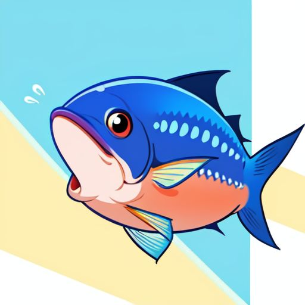
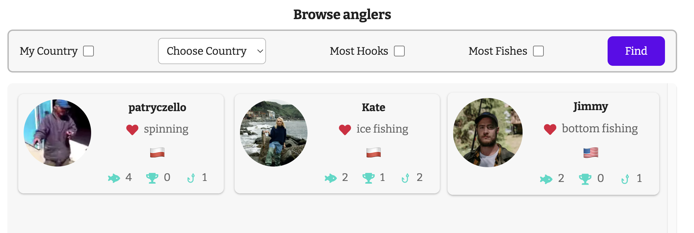
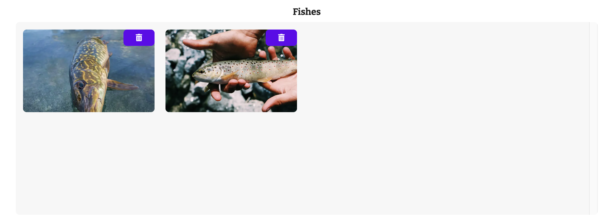
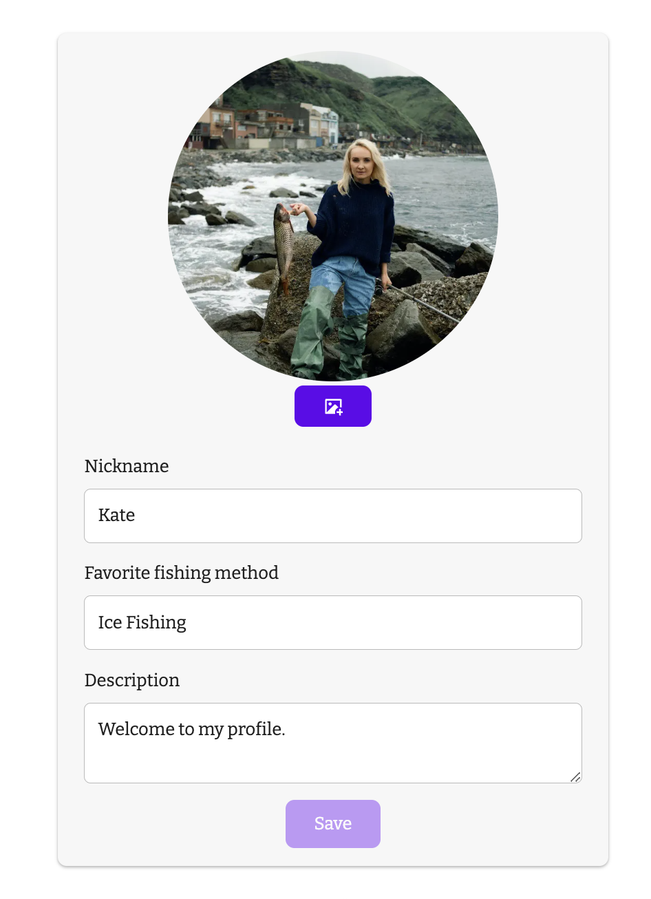
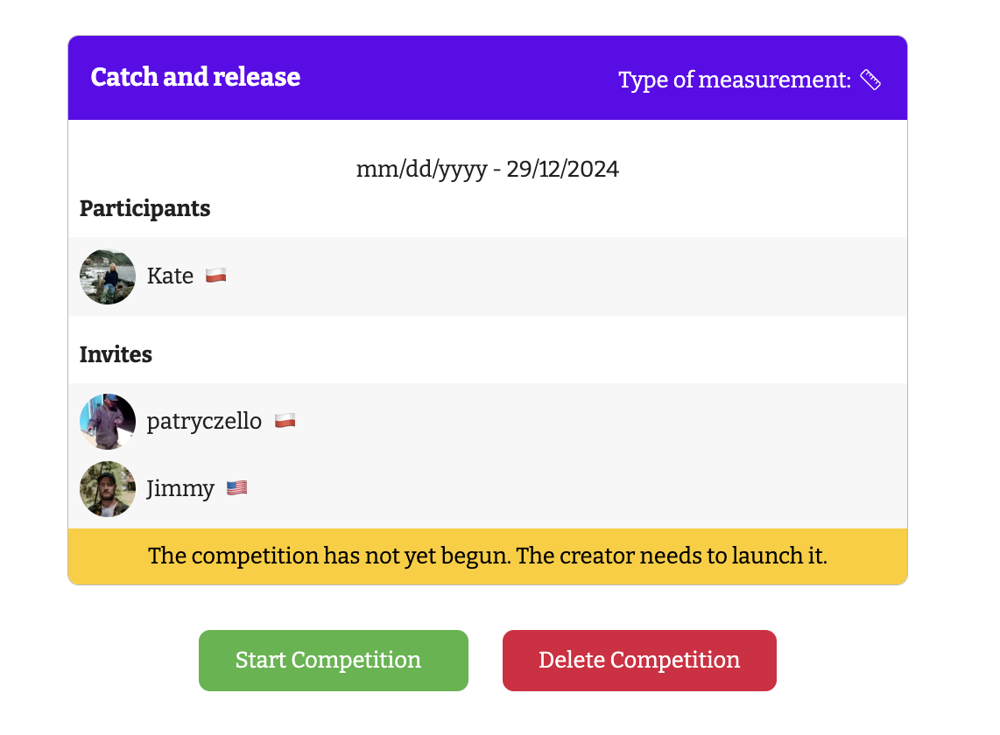
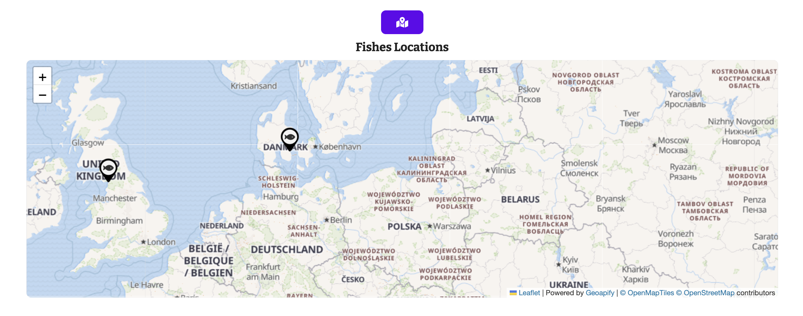

# Big Fishes

Portal for lovers of fishing, competition and for those who want to develop their passion.

> Check out the live site: [Big Fishes](https://bigfishes.org)

## Screenshots

## Built With

-   [Next.js](https://nextjs.org/)
-   [Tailwind](https://tailwindcss.com/)
-   [React Icons](https://react-icons.github.io/react-icons/)
-   [Leaflet](https://leafletjs.com/)
-   [Redux Toolkit](https://redux-toolkit.js.org/)
-   [Next Themes](https://github.com/pacocoursey/next-themes)
-   [Framer Motion](https://motion.dev/)

## To do

-   Add email sender and password reminder option
-   Add real-time chat for anglers

## Contact

-   Email: [patryk.popiela01@gmail.com](mailto:patryk.popiela01@gmail.com)
-   GitHub: [Laczeek](https://github.com/Laczeek)

## Backend

[Check out the backend repository](https://github.com/Laczeek/BigFish_BACKEND)

---

### Hosted on [Render](https://render.com/)
